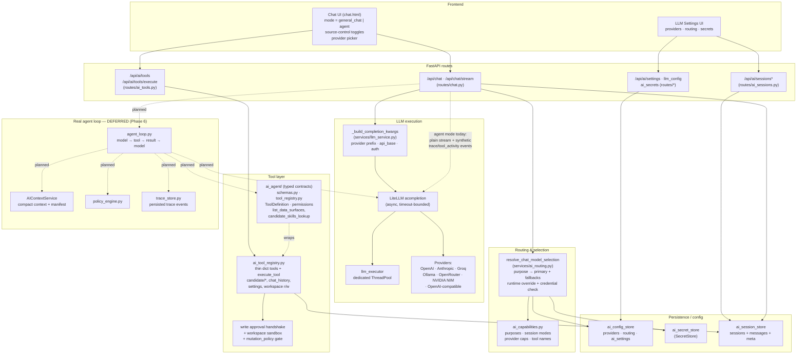
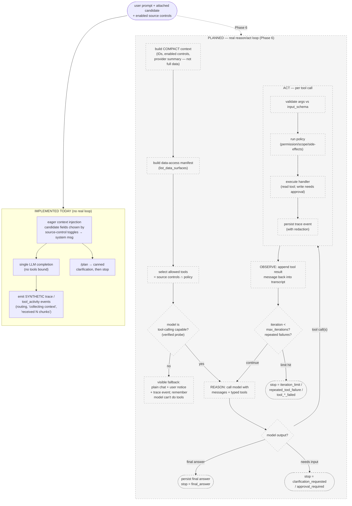

# AI Agent — Architecture Graph & Description

> Snapshot of how the AI/agent subsystem is wired **today** and where the real
> agent loop is still a placeholder. Solid nodes/edges are implemented; dashed
> nodes/edges are the deferred Phase 6 "Real Agent Runtime" (see `roadmap.md`).
> Source of truth: code under `job-finder-web/backend/`.

## System graph



## How a turn flows today (implemented)

1. **Request.** The Chat UI posts to `/api/chat` (JSON) or `/api/chat/stream`
   (SSE) with `mode`, `message`, optional `session_id`, `model_id`, and a
   `selected_provider_config_id`. `mode=agent` maps to routing purpose `agent`;
   otherwise `general_chat` (`routes/chat.py:521`).
2. **Routing.** `resolve_chat_model_selection` (`services/ai_routing.py`) picks a
   provider/model. Precedence: explicit `model_id` → explicit configured
   provider → the purpose's routing rule (`primary_provider_id` then
   `fallback_provider_ids`). It honors `allow_runtime_override`, resolves
   credentials via `SecretStore`/env, and silently falls back to the routing
   order if an explicitly requested provider is unusable.
3. **Session + context.** `ai_session_store` gets/creates the session, persists
   the user message, and auto-titles it. `_build_session_system_context` eagerly
   injects candidate profile/titles/skills/documents/preferences into a system
   message — but **only** for the fields whose source-control toggles are on and
   only when a candidate is attached.
4. **Execution.** `_build_completion_kwargs` translates the provider into a
   LiteLLM model string (provider prefix, `api_base`, auth: API key / encrypted
   key / Claude Code OAuth). The call goes through async `acompletion` under a
   timeout; a dedicated `llm_executor` ThreadPool isolates blocking LLM work.
5. **Response.** Non-stream returns the full message + usage/selection metadata;
   stream emits `session` → `chunk`* → `done` SSE events. The assistant message
   is persisted with latency, token usage, and resolved-vs-requested provider
   metadata.

### Agent mode, as it actually behaves now

`mode=agent` does **not** yet run a real tool-calling loop. It:
- routes through the `agent` purpose,
- emits **synthetic** `trace`/`tool_activity` SSE events (routing, "collecting
  context", "received N chunks"),
- has a `/plan` stub that returns a canned `interaction_required` clarification,
- then streams an ordinary chat completion.

No typed tools are sent to the model, the model cannot choose tools, and there
is no iterative model→tool→result loop. This is the documented gap
(`history/ai-agent-architecture-review-2026-06-04.md`).

## Tool layer (implemented, but not model-driven)

Two registries coexist:

- **`ai_tool_registry.py`** — the working one. Thin dict tool specs plus
  `execute_tool()`. Read tools: `candidate_profile/titles/skills/documents/
  preferences/jobs/employers/applications_lookup`, `chat_history_lookup`,
  `settings_lookup`, `workspace_files_read`. Write tool:
  `workspace_files_write`. These are invoked **only** via the REST endpoint
  `/api/ai/tools/execute`, not by the model. Safety: path sandbox under
  `AI_WORKSPACE_ROOT`, a write **approval handshake** (`approval.state ==
  approved`, else HTTP 409), and a `mutation_policy` gate that blocks writes
  unless set to `allow_writes`.
- **`ai_agent/`** — the typed foundation for the future loop. `schemas.py`
  defines `ToolDefinition` (JSON input/output schemas, `ToolPermission`
  read/draft/write/external, tier, scopes, side-effects, result-size limits,
  trace redaction), `AgentStopReason`, and an argument validator.
  `tool_registry.py` currently exposes two typed tools — `list_data_surfaces`
  (the discovery/manifest tool) and `candidate_skills_lookup` (wraps the thin
  registry). `to_model_tool()` can already emit OpenAI function-tool JSON, but
  nothing calls it yet.

## Deferred — the real agent runtime (Phase 6)

Planned but **not yet built** (`roadmap.md` Phase 6; dashed in the graph):

- `agent_loop.py` — iterate: build compact context + data-access manifest →
  select tools allowed by source controls + policy → resolve a
  tool-calling-capable model → loop `model → validate args → policy → execute →
  persist trace → feed result back` → stop on one of the `AgentStopReason`
  values (`final_answer`, `tool_call_validation_failed`,
  `tool_execution_failed`, `repeated_tool_failure`, `iteration_limit`,
  `clarification_requested`, `approval_required`, `provider_lacks_tool_calling`).
- `AIContextService` — move context out of `routes/chat.py`; keep always-on
  context compact (IDs, enabled controls, provider summary) and let deeper data
  load lazily through tools instead of prompt-preloading.
- `policy_engine.py` and `trace_store.py` — real policy checks and a persisted
  trace store replacing today's synthetic events.
- **Capability enforcement** (`docs/design/agent-provider-capabilities.md`):
  capabilities attach per-model and are *verified* by a probe, not just
  declared. Agent mode routes past no-tools models; if a runtime "tools
  unsupported" error still occurs it degrades to plain chat **visibly** (user
  notice + trace event) and remembers the model can't do tools.

## The agentic loop (reason → act → observe), isolated

This view drops all HTTP/UI/persistence plumbing and shows only the agent's
own decision loop. **Almost none of this is live yet** — the only implemented
path is the "placeholder" branch (a single plain completion dressed with fake
trace events). Everything inside the dashed box is the Phase 6 target.



### Reading the loop

- **REASON** — the model is called with the running message list **plus typed
  tool schemas** (`ToolDefinition.to_model_tool()`), so it can *choose* to call
  a tool or answer. This binding is the single most important thing missing
  today.
- **ACT** — for each tool call the server validates args against the tool's JSON
  `input_schema`, runs policy (permission class `read`/`draft`/`write`/
  `external`, required scopes, side-effects), executes the handler, and records
  a redacted trace event. Writes additionally require the approval handshake and
  `mutation_policy=allow_writes`.
- **OBSERVE** — each tool result is appended back as a tool-result message; the
  loop returns to REASON with that new evidence. This is the model→tool→result→
  model cycle that does not exist yet.
- **Termination** — every path ends on an explicit `AgentStopReason` (already
  defined in `ai_agent/schemas.py`): `final_answer`, `clarification_requested`,
  `approval_required`, `iteration_limit`, `repeated_tool_failure`,
  `tool_call_validation_failed`, `tool_execution_failed`,
  `provider_lacks_tool_calling`. There is no open-ended running.
- **Capability gate** — before REASON, agent mode skips models whose *verified*
  capability says no tools; a runtime "tools unsupported" error still degrades
  **visibly**, never silently (`docs/design/agent-provider-capabilities.md`).

### What of the loop exists in code right now

| Loop stage | Status | Where |
| --- | --- | --- |
| Typed tool contracts / arg validation | ✅ built (unused by a loop) | `ai_agent/schemas.py`, `ai_agent/tool_registry.py` |
| `to_model_tool()` (bind tools to model) | ✅ exists, ❌ never called | `ai_agent/schemas.py:66` |
| Stop-reason vocabulary | ✅ defined, ❌ not driven by a loop | `ai_agent/schemas.py:18` |
| Tool handlers (read) + write approval | ✅ built (via REST only) | `ai_tool_registry.py`, `routes/ai_tools.py` |
| `list_data_surfaces` manifest tool | ✅ defined | `ai_agent/tool_registry.py:50` |
| REASON call with tools bound | ❌ planned | `agent_loop.py` (missing) |
| ACT/OBSERVE iteration | ❌ planned | `agent_loop.py` (missing) |
| Compact context + manifest step | ❌ planned | `AIContextService` (missing) |
| Policy engine + trace store | ❌ planned | `policy_engine.py`, `trace_store.py` (missing) |
| Capability gate + visible fallback | ❌ planned | per `agent-provider-capabilities.md` |

## Key files

| Concern | File |
| --- | --- |
| Chat + (placeholder) agent endpoints | `backend/routes/chat.py` |
| Purpose-based routing & fallback | `backend/services/ai_routing.py` |
| LiteLLM call construction | `backend/services/llm_service.py` |
| Isolated LLM thread pool | `backend/services/llm_executor.py` |
| Thin tools + executor + sandbox | `backend/ai_tool_registry.py` |
| Tool REST + write approval | `backend/routes/ai_tools.py` |
| Typed tool contracts (future loop) | `backend/ai_agent/schemas.py`, `backend/ai_agent/tool_registry.py` |
| Purposes / modes / capabilities | `backend/ai_capabilities.py` |
| Config / secrets / sessions | `backend/ai_config_store.py`, `ai_secret_store.py`, `ai_session_store.py` |
| Decisions | `docs/adr/0001-ai-foundation-source-of-truth.md`, `docs/design/agent-provider-capabilities.md` |
| Gap analysis | `history/ai-agent-architecture-review-2026-06-04.md` |
```
